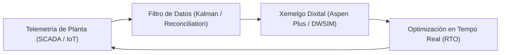

::: {.hero-banner}
::: {.hero-content}
<h2 class="text-white fw-bold mb-2">🌐 Tema 1: Paradigmas Actuais e Digital Twins</h2>
<p class="text-light mb-0">Evolución computacional da enxeñaría química e conexión automatizada via Python-COM.</p>
:::
:::

::: {.trilingual-summary}
::: {.trilingual-header}
🌐 Resumo Executivo Trilingüe / Trilingual Executive Summary
:::

::: {.lang-block}
<span class="lang-flag">Galego (Vehicular)</span>
O Tema 1 analiza a transformación dixital na enxeñaría química, dende os balances manuais ata a implantación de Xemelgos Dixitais (*Digital Twins*) que conectan datos da instrumentación en tempo real de plantas industriais con modelos termodinámicos rigorosos en simuladores como Aspen Plus. Mostrárase a configuración paso a paso da interface COM/OLE para automatizar a simulación mediante scripts en Python.
:::

::: {.lang-block}
<span class="lang-flag">Castelán (Español)</span>
El Tema 1 analiza la transformación digital en ingeniería química, desde balances manuales hasta la implantación de Gemelos Digitales (*Digital Twins*) que conectan datos en tiempo real de plantas industriales con modelos termodinámicos rigurosos en Aspen Plus. Se detalla la configuración paso a paso de la interfaz COM/OLE para la automatización mediante Python.
:::

::: {.lang-block}
<span class="lang-flag">Inglés (English)</span>
Topic 1 explores the digital transformation in chemical engineering, evolving from manual balances to real-time Digital Twins connecting plant sensor telemetry with rigorous thermodynamic models in Aspen Plus. Step-by-step configuration of the Python COM/OLE interface for automated flowsheeting is fully detailed.
:::
:::

---

## 1. Evolución Histórica e Paradigmas Computacionais

A modelización en enxeñaría química sufriu tres revolucións fundamentais:

1. **Era Analóxica e Monografías (Pre-1960):** Cálculo de liñas de destilación mediante diagramas de McCabe-Thiele debuxados a man.
2. **Era dos Simuladores Modular-Secuenciais (1970 - 2000):** Aparición de FLOWTRAN, Aspen Plus e HYSYS para resolver diagramas de fluxo enteiros.
3. **Era Dixital e Digital Twins (2010 - Actualidade):** Integración de modelos baseados na física con estratexias de *Machine Learning* e telemetría en tempo real mediante protocolos IoT industriais.



---

## 2. Configuración da Interface Python-COM

A comunicación entre Python e Aspen Plus prodúcese a través da interface **Component Object Model (COM)** de Microsoft Windows. O paquete `win32com.client` permite instanciar o servidor de automatización de Aspen:

```python
import win32com.client
import os

# Instanciar o servidor de automatización de Aspen Plus
aspen = win32com.client.Dispatch("Apwn.Document")

# Cargar un ficheiro de simulación existente (.bkp ou .apw)
file_path = os.path.abspath("planta_destilacion.bkp")
aspen.InitFromArchive2(file_path)

# Tornar a aplicación visible para depuración
aspen.Visible = True

# Acceder á árbore de variables e ler a temperatura dunha corrente
temp_alimento = aspen.Tree.FindNode(r"\Data\Streams\ALIM\Output\TEMP_OUT\MIXED").Value
print(f"Temperatura da corrente de alimento: {temp_alimento:.2f} K")

# Executar a simulación
aspen.Engine.Run2()

print("Simulación executada con éxito via Python-COM!")
```

---

## 🎧 Pílula de Audio NotebookLM & Material Audiovisual

::: {.media-container}
::: {.media-header}
::: {.media-icon}
🎙️
:::
**Podcast Técnico NotebookLM: Digital Twins en Enxeñaría Química**  
*Resumo en formato de diálogo profundizando nos retos de sincronización de datos de planta.*
:::

<audio controls class="w-100 mt-2">
  <source src="podcast-tema1.mp3" type="audio/mpeg">
  O teu navegador non soporta o elemento de audio.
</audio>

::: {.mt-3}
💡 **Recurso de Estudo:** Consulta o caderno de traballo interactivo en [NotebookLM SOPQ Tema 1](https://notebooklm.google.com).
:::
:::
