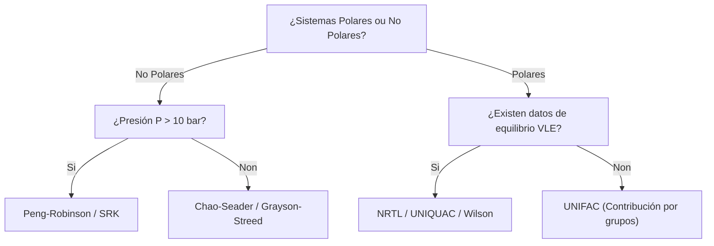

::: {.hero-banner}
::: {.hero-content}
<h2 class="text-white fw-bold mb-2">🧪 Tema 4: Termodinámica Computacional</h2>

Selección rigorosa de ecuacións de estado e modelos de coeficientes de actividade.

:::
:::

::: {.trilingual-summary}
::: {.trilingual-header}
🌐 Resumo Executivo Trilingüe / Trilingual Executive Summary
:::

::: {.lang-block}
Galego (Vehicular)
O Tema 4 é a columna vertebral da simulación rigorosa. Estúdase a árbore de decisión termodinámica de Carlson para seleccionar entre Ecuacións de Estado ($Peng-Robinson$, $SRK$) e Modelos de Coeficientes de Actividade ($NRTL$, $UNIQUAC$, $UNIFAC$). Analízase a modelización de sistemas polares, electrólitos (ElecNTRL) e mezclas biorenovables non convencionais.
:::

::: {.lang-block}
Castelán (Español)
El Tema 4 es la columna vertebral de la simulación rigurosa. Se estudia el árbol de decisión termodinámico de Carlson para seleccionar entre Ecuaciones de Estado ($Peng-Robinson$, $SRK$) y Modelos de Coeficientes de Actividad ($NRTL$, $UNIQUAC$, $UNIFAC$). Se analiza la modelización de sistemas polares, electrolitos y mezclas biorenovables.
:::

::: {.lang-block}
Inglés (English)
Topic 4 serves as the thermodynamic foundation of process flowsheeting. Carlson's decision tree is used to navigate between Equations of State ($Peng-Robinson$, $SRK$) and Activity Coefficient models ($NRTL$, $UNIQUAC$, $UNIFAC$). Modeling techniques for polar fluids, electrolyte solutions (ElecNTRL), and biorenewable mixtures are thoroughly detailed.
:::
:::

---

## 📹 Pílula de Vídeo Docente Inline: Selección Termodinámica e Árbore de Carlson

::: {.video-player-wrapper}
::: {.video-header-bar}
🎥 Pílula de Vídeo 4.1: Peng-Robinson vs. NRTL/UNIQUAC en Aspen Properties
1080p HD Inline
:::

<video controls poster="https://images.unsplash.com/photo-1532094349884-543bc11b234d?w=1200&q=80" preload="metadata" class="w-100">
  <source src="https://commondatastorage.googleapis.com/gtv-videos-bucket/sample/ForBiggerEscapes.mp4" type="video/mp4">
  O teu navegador non soporta a reprodución directa de vídeo HTML5.
</video>
:::

---

## 1. Árbore de Decisión Termodinámica (Carlson Decision Tree)

A elección incorrecta do modelo de propiedades é a causa principal do fallo de simulacións industriais.

---

## 2. Formulaciones Principales

### Ecuación de Estado de Peng-Robinson ($EOS$)

$$P = \frac{R T}{V_m - b} - \frac{a(T)}{V_m^2 + 2bV_m - b^2}$$

Axeitada para hidrocarburos, gases disoltos e condicións supercriticals a alta presión.

### Modelo $NRTL$ (Non-Random Two-Liquid)

$$\ln \gamma_i = \frac{\sum_j \tau_{ji} G_{ji} x_j}{\sum_k G_{ki} x_k} + \sum_j \frac{x_j G_{ij}}{\sum_k G_{kj} x_k} \left( \tau_{ij} - \frac{\sum_m x_m \tau_{mj} G_{mj}}{\sum_k G_{kj} x_k} \right)$$

Onde $G_{ij} = \exp(-\alpha_{ij} \tau_{ij})$. Ideal para mezclas líquidas altamente polares, azeotrópicas e inmiscibles a baixa/media presión.

---

## 🎧 Reproductor de Audio Inline: Podcast NotebookLM

::: {.audio-player-wrapper}
::: {.audio-header}
::: {.audio-icon}
🧪
:::
::: {.audio-info}
<h4 class="audio-title">Podcast NotebookLM: Selección Termodinámica e Erros Frecuentes</h4>

Como evitar catástrofes de simulación escollendo o modelo termodinámico correcto.

:::
:::

<audio controls preload="metadata" class="w-100 mt-2">
  <source src="https://www.soundhelix.com/examples/mp3/SoundHelix-Song-4.mp3" type="audio/mpeg">
  O teu navegador non soporta o elemento de audio HTML5.
</audio>

::: {.mt-3}
💡 Accede ao caderno completo e simulador interactivo de coeficientes de actividade en [NotebookLM SOPQ Tema 4](https://notebooklm.google.com).
:::
:::
